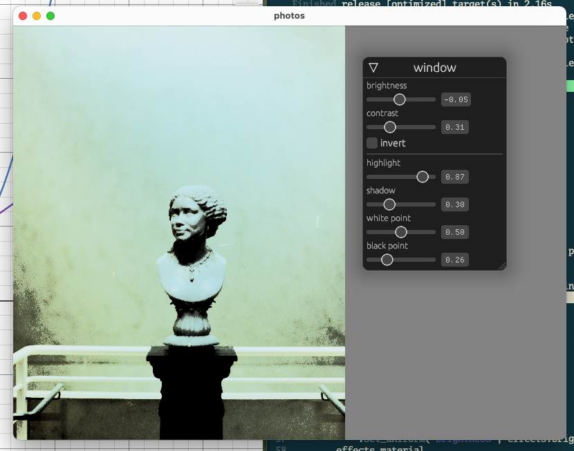

# photos1

A photo editing application.

## todo

* effects shader
	* [x] brightness and contrast
	* [x] hightlight, shadow, white pt, black pt
	* [ ] saturation
	* [x] temperature
	* [ ] tint
	* [x] toggle original
* ui
	* [ ] zoom and pan image
	* [ ] crop, small rotations, and 90 degree rotations (passed through to the file)
	* [ ] handle more image formats (needs to get pixel buf from other library)
	* [ ] folder viewer
	* [ ] saving edits
	* [ ] exporting edits (needs offscreen rendering pipeline)

